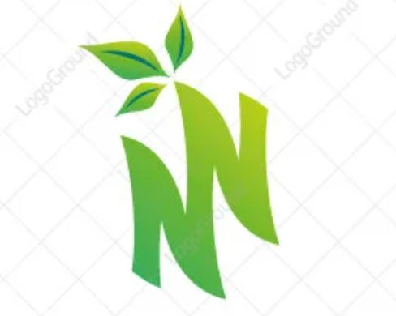
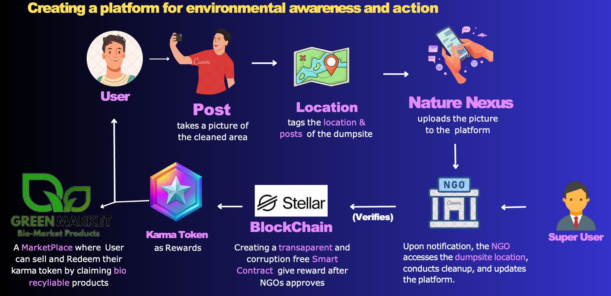
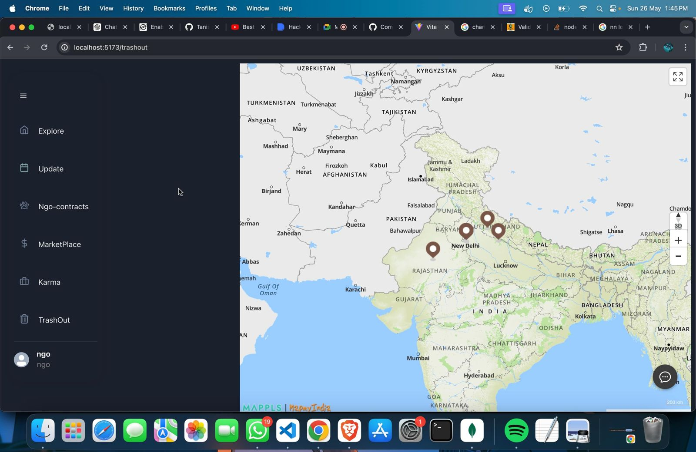
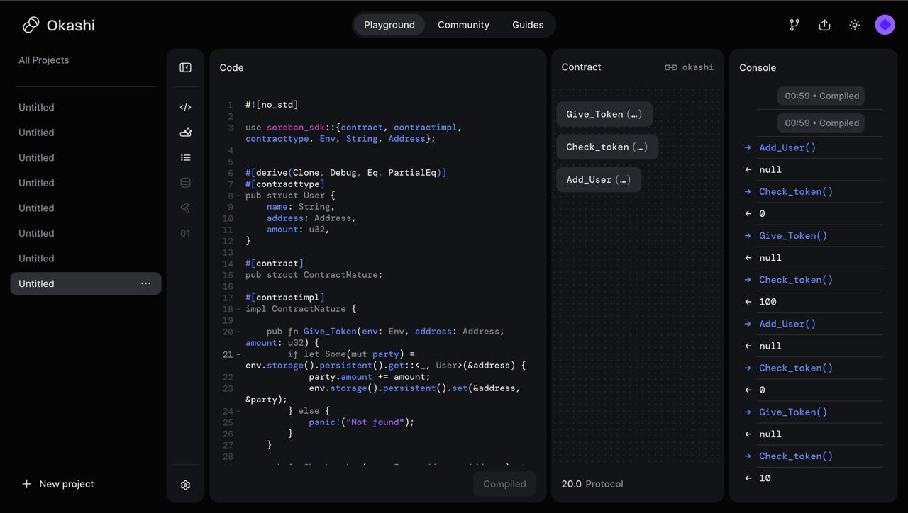

# **Nature Nexus**


__Where innovation meets bioDiversity__


## **Table of Contents**

- [Developers](#Developers)
- [Introduction](#introduction)
- [Description](#Description)
- [Vision](#Vision)
- [Tech Stack](#tech-stack)
- [Deployment](#Deployment)

## **Developers**

- Shivansh Chauhan - [Github](https://github.com/Programmer-Shivansh)
- Tanishq  - [Github](https://github.com/Tanishq1604)


## **Introduction**
Nature Nexus is a cutting-edge waste management application tailored to address India's urgent waste management challenges, employing blockchain technology for efficiency. Powered by the Soroban SDK, React, and Express, it establishes a decentralized, community-centric platform. Users are incentivized to report and manage waste responsibly through Karma Tokens, fostering a collaborative approach to waste reduction. Join us in revolutionizing waste management practices for a cleaner, greener Delhi.
With India generating approximately 62 million tons of waste annually and a shortage of personnel in the government sector, innovative solutions are urgently needed. Nature Nexus addresses this challenge by privatizing aspects of the Municipal Corporation of Delhi (MCD) sector and leveraging community engagement and NGO partnerships. Through our app, users can report waste issues, earn Karma Tokens, and purchase eco-friendly products in our marketplace.

## **Description**


Nature Nexus embodies a comprehensive solution to multifaceted waste management challenges. Commencing with user-generated content, individuals initiate the process by uploading posts highlighting prevalent issues such as waste dumpsites and mismanagement in their vicinity. This crowdsourced data serves as a crucial foundation for addressing and mitigating waste-related concerns effectively. The platform integrates advanced technologies such as blockchain, leveraging the Soroban SDK, React, and Express, to establish a decentralized ecosystem.

Upon submission, posts undergo rigorous evaluation by collaborating NGOs to ensure accuracy and relevance. Approved submissions are then rewarded with Karma Tokens via smart contracts, facilitated seamlessly through the Frieghter wallet. These tokens not only serve as a form of recognition for users' contributions but also incentivize further participation in waste management initiatives.

By incentivizing user engagement, Nature Nexus tackles various issues simultaneously. Firstly, it addresses the challenge of inadequate waste management infrastructure by leveraging community-driven efforts to identify and report dumpsites. Secondly, it fosters environmental consciousness and proactive participation among citizens, encouraging responsible waste disposal practices. Thirdly, the platform facilitates the integration of blockchain technology, enhancing transparency and accountability in waste management processes.

Moreover, the Karma Token system introduces a novel incentive mechanism, rewarding users for their eco-friendly actions and encouraging the adoption of sustainable consumption habits. This, in turn, promotes a circular economy by facilitating the exchange of Karma Tokens for bio-recyclable products within the platform.

Overall, Nature Nexus represents a holistic approach to waste management, leveraging technology, community participation, and incentivization to address pressing environmental challenges and pave the way for a cleaner, more sustainable future.

#__How It Works__



User Participation: Users can post images of waste dumps or problematic areas through the app. This simple interface encourages community involvement by making reporting easy.

NGO Verification: Submitted posts are sent in contract form to our network of partnered NGOs and organizations. These entities verify the accuracy and relevance of the reported data, ensuring that the information is correct and aligns with real-world conditions.

Karma Tokens: Verified reports earn users Karma Tokens, incentivizing continuous participation. These tokens can be accumulated and exchanged for eco-friendly products in our marketplace.

Sustainable Marketplace: The app features a marketplace where users can use Karma Tokens to purchase bio-items created by other users. This fosters a circular economy, promoting sustainable practices and reducing waste.

Support for Eco-Entrepreneurs: Users who sell bio-items on the marketplace receive financial support from NGOs. This not only promotes the use of sustainable products but also provides economic benefits to those contributing to environmental preservation.

- Map locations of User Posts



- Deployment of Contracts
  


## **Vision**
 - Partnerships with Corporations: 
 Nature Nexus forms partnerships with corporations committed to sustainability, leveraging their resources and expertise to implement innovative waste management solutions. These collaborations may involve the development of eco-friendly packaging, recycling programs, and sustainable product design.

- Expansion to Rural Areas:
 Nature Nexus expands its reach to rural areas where waste management infrastructure is lacking. Through partnerships with local NGOs and grassroots organizations, the platform empowers rural communities to implement decentralized waste management solutions tailored to their specific needs.

- Education and Awareness Programs:
 Nature Nexus invests in education and awareness programs targeting schools, universities, and community centers. These programs educate people of all ages about the importance of waste management, recycling, and environmental conservation, fostering a generation of environmentally conscious citizens.

- Global Collaboration for Sustainable Development Goals: 
Nature Nexus joins forces with other organizations and initiatives aligned with the United Nations Sustainable Development Goals (SDGs). By collaborating on shared objectives such as zero waste, clean water, and sustainable cities, the platform contributes to global efforts to build a more sustainable future for all.

- Citywide Waste Reduction Campaigns: 
Nature Nexus collaborates with local governments and environmental organizations to launch citywide waste reduction campaigns. These initiatives involve mass clean-up drives, awareness programs, and community events aimed at instilling a culture of waste reduction and recycling.


## **Tech Stack**

- **Frontend**: React js
- **Backend**: Express js
- **Blockchain**: Rust , Soroban SDK, Stellar
- **Authentication**: Freighter Wallet
- **Database**: MongoDB


## **Deployment**


### **Prerequisites**

- Node.js
- npm (Node Package Manager)
- Git

### **Steps to Run in Browser**

1. **Clone the Repository**

   ```bash
   git clone https://github.com/Tanishq1604/Nature-Nexus.git
   cd Nature-Nexus


2. **Install Dependencies**

```bash
npm install
Set Up Environment Variables

```

Create a .env file in the root directory and add the following variables:

## **Add in backend**
- PORT=4000
- MONGO_URI=<your_mongo_uri>
- JWT_SECRET=<your_jwt_secret>
- CLOUDINARY_NAME=<your_cloudinary_name>
- CLOUDINARY_KEY=<your_cloudinary_key>
- CLOUDINARY_SECRET=<your_cloudinary_secret>

## **Add in Frontend for Smart Contract**
- PUBLIC_KEY=<your_public_key>
- SECRET=<your_secret>
- CONTRACT_ID=<your_contract_id>


### **Start the Application**

```bash
Frontend :- npm run dev
Backend :- npm start
   ```


